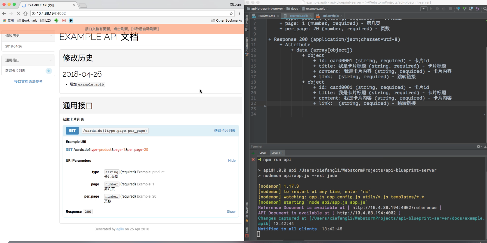

# api-blueprint-server

An api document server which enable auto-refresh all clients when local watched files changed, 
to keep the api document always fresh to watchers.



## usage

- `git clone https://github.com/XfLoops/api-blueprint-server.git`

- `cd api-blueprint-server`

- `npm i && npm run api`


## feature

- convert `.md` or `.apib` files to `html`, which is available to access via the given `url`
- notify clients the file changes and auto-refresh the api document
- provide `blueprint` reference
- provide `markdown` reference


## config

```javascript

  // api文档所在目录 
const APIB_DIR = './docs' 

  // 解析路径
const resolvePath = p => path.resolve(__dirname, p)

const config = {
  // where the `.md` or `.apib` files place
  entry: resolvePath(APIB_DIR),

  // files to watch
  watch: [
    resolvePath(`${APIB_DIR}/*.apib`)
  ],

  // render option
  renderOption: {
    themeTemplate: resolvePath('./templates/index.jade'),
    themeVariables: 'default',
    locals: {}
  },

  // client wait seconds to refresh
  waitUtilRefresh: 5,

  // replace fonts cdn, which is useful to Chinese developers
  fonts: {
    oldCDN: 'fonts.googleapis.com',
    newCDN: 'fonts.lug.ustc.edu.cn'
  }
}
```

see more config detail: [api.config.js](api.config.js)